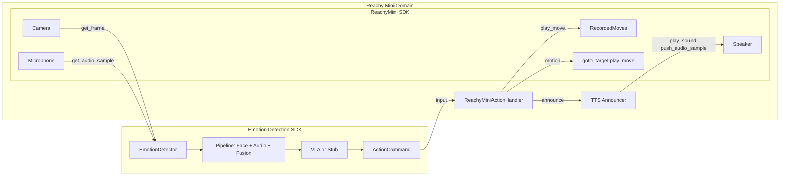

# Reachy Mini Emotion-Responsive App

## Architecture



**Domain boundary**: The Reachy Mini domain receives `ActionCommand` as its sole input. The ReachyMini SDK (camera, mic, speaker, RecordedMoves, motion) is the platform the handler and TTS use. The handler invokes SDK motion and RecordedMoves; TTS generates audio and uses the SDK's speaker API to play it.


## Key Interfaces

**Reachy Mini domain input** – `ActionCommand` from the emotion SDK (`[ActionCommand](../emotion-detection-action/src/emotion_detection_action/core/types.py)`):

- `action_type`: idle, acknowledge, comfort, de_escalate, reassure, wait, retreat, approach, gesture, speak
- `parameters`: `{gesture, intensity, emotion, duration, ...}`

**Reachy Mini SDK** ([docs](https://huggingface.co/docs/reachy_mini/SDK/readme)) – platform providing:

| SDK component | API | Used by |
|---------------|-----|---------|
| Camera | `get_frame()` → BGR numpy array | Emotion Detector (main loop passes frame) |
| Microphone | `get_audio_sample()` → (samples, 2) float32 @ 16 kHz | Emotion Detector (main loop passes audio) |
| Speaker | `play_sound(path)` or `start_playing()` + `push_audio_sample()` + `stop_playing()` | TTS Announcer |
| RecordedMoves | `RecordedMoves("pollen-robotics/reachy-mini-emotions-library")`, `get(move_name)` | Handler (via `play_move`) |
| Motion | `goto_target()`, `play_move(move)` | Handler |

- `ReachyMini(media_backend="default")` enables Camera and Microphone; `start_recording()` / `stop_recording()` required for Mic
- `look_at_image(u, v, duration)` – optional gaze at face

**Emotion SDK** ([detector.py](../emotion-detection-action/src/emotion_detection_action/core/detector.py)):

- Receives frame (from Reachy Camera) and audio (from Reachy Mic) via `process_frame(frame, audio=None, timestamp=0.0)`
- Outputs `ActionCommand` to Reachy Mini domain

---

## Implementation Plan

**Domain separation**: The emotion SDK produces `ActionCommand`; the Reachy Mini domain consumes it. The Reachy Mini domain uses the ReachyMini SDK (Camera, Mic, Speaker, RecordedMoves, Motion). The handler invokes Motion and RecordedMoves; TTS invokes Speaker. The domain boundary is the `ActionCommand` interface.

### 1. Project Setup

Create minimal project structure in `reachy-emotion/`:

- `pyproject.toml` with dependencies:
  - `emotion-detection-action` (path or editable install from `../emotion-detection-action`)
  - `reachy-mini` (from PyPI)
  - `opencv-python` (for camera)
  - `gtts` (Google Text-to-Speech) or `pyttsx3` (offline TTS)
- `README.md` with setup and run instructions

### 2. ReachyMiniActionHandler (Reachy Mini Domain)

The handler lives in the **Reachy Mini domain**. It receives `ActionCommand` as input and invokes the **ReachyMini SDK** for motion and announcement:

- **Motion** – `goto_target()`, `play_move()` (handler calls SDK Motion APIs)
- **RecordedMoves** – handler uses `RecordedMoves.get(move_name)` and passes to `play_move()` (RecordedMoves is part of the SDK)
- **Announce** – handler delegates to TTS Announcer, which uses the SDK Speaker API (see section 2b)

**Location**: `reachy_emotion/reachy_handler.py` (or `src/reachy_emotion/`)

**Design**:

- Extend `BaseActionHandler` from `emotion_detection_action.actions.base`; implements `execute(action: ActionCommand) -> bool` – receives `ActionCommand` as input
- Implement `connect()` / `disconnect()`: instantiate `ReachyMini(media_backend=...)` and hold reference to the SDK
- Implement `execute(action: ActionCommand) -> bool`: dispatch by `action_type`, invoke SDK Motion and RecordedMoves
- **Shared instance**: The handler's `ReachyMini` instance is also used by the main loop to get frames (Camera) and audio (Mic) from the SDK

**Action-to-SDK mapping** (handler invokes Motion and RecordedMoves):


| action_type | SDK invocation                                                                      |
| ----------- | ----------------------------------------------------------------------------------- |
| idle        | Motion: `goto_target(antennas=[0, 0])`                                               |
| acknowledge | RecordedMoves + Motion: `play_move(moves.get("happy"))` or `goto_target` head nod   |
| comfort     | RecordedMoves + Motion: `play_move(moves.get("sad"))`                                |
| de_escalate | Motion: `goto_target(body_yaw=-0.2)`                                                |
| reassure    | RecordedMoves + Motion: `play_move(moves.get("fearful"))`                            |
| wait        | No-op (hold pose)                                                                    |
| retreat     | Motion: `goto_target(body_yaw=-0.3)`                                                |
| approach    | Motion: `goto_target(body_yaw=0.2)`                                                 |
| gesture     | RecordedMoves + Motion: pick move from `parameters["gesture"]` or `parameters["emotion"]` |
| speak       | TTS Announcer → Speaker: `play_sound` / `push_audio_sample`                          |


**Emotion announcement** (handler → TTS → Speaker):

- On each `execute(action)`, after invoking Motion/RecordedMoves, the handler calls the TTS Announcer
- TTS generates speech from text (e.g. "I detect you seem happy") and uses the **SDK Speaker API** (`play_sound` or `push_audio_sample`) to play it
- Use `action.parameters.get("emotion")` or pass `EmotionResult` from main loop
- **TTS flow**: Generate speech → convert to float32 16 kHz mono → `mini.media.start_playing()` → `push_audio_sample(chunk)` → `stop_playing()`
- **TTS library**: `gTTS` or `pyttsx3`; announcement template: "I detect you seem {emotion}"
- **Throttling**: Only announce when emotion changes or after minimum interval (e.g. 5 seconds)

**Emotion fallback**: When `action_type` is generic (e.g. `gesture`, `stub`), use `parameters.get("emotion")` to select from emotions library: `happy`, `sad`, `angry`, `fearful`, `surprised`, `disgusted`, `neutral`. Use `RecordedMoves.list_moves()` to discover available move names and map emotion labels to closest match.

**Threading**: Reachy Mini SDK calls are blocking. Run `execute()` in a thread or use non-blocking `set_target` for high-frequency updates. For `play_move`, blocking is acceptable. Run announcement in a background thread to avoid blocking the main loop.

### 2b. TTS Announcer – Reachy Mini Domain

**Location**: `reachy_emotion/tts_announcer.py` (within the Reachy Mini domain)

- **Role**: Convert detected emotion to speech and play through the **ReachyMini SDK Speaker** (`play_sound` / `push_audio_sample`)
- **API**: `announce(emotion: str, mini: ReachyMini) -> None` – generates "I detect you seem {emotion}", converts to audio, invokes SDK Speaker API
- **Flow**: Handler → TTS Announcer → SDK Speaker (per diagram)
- **Throttling**: Caller (handler or main loop) enforces minimum interval and emotion-change check before calling `announce()`

### 3. Main App Entry Point

**File**: `reachy_emotion/main.py` or `run.py`

**Data flow** (aligned with diagram):

1. **ReachyMini SDK** provides Camera and Microphone
2. Main loop polls `frame = mini.media.get_frame()` (Camera) and `audio = mini.media.get_audio_sample()` (Mic)
3. Main loop passes frame and audio to **Emotion Detector** → Pipeline → VLA → `ActionCommand`
4. Main loop passes `ActionCommand` to **Handler** (Reachy Mini domain input)
5. Handler invokes SDK Motion, RecordedMoves, and TTS; TTS invokes SDK Speaker

- Parse CLI: `--sim`, `--device`, `--media-backend`, `--use-webcam`, `--no-audio`, `--no-announce`
- Connect: `ReachyMini(media_backend=...)` – enables SDK Camera and Mic
- **Audio setup**: Call `mini.media.start_recording()` after connect; `stop_recording()` on shutdown
- Frame loop: poll SDK Camera and Mic → `detector.process_frame(frame, audio=audio_mono, ...)` → handler receives `result.action`
- Handle `get_frame()` or `get_audio_sample()` returning `None` (retry/skip)

**Audio format conversion** (SDK Mic → Emotion SDK):

- SDK Mic returns `(samples, 2)` float32 stereo at 16 kHz; convert to mono: `audio.mean(axis=1)`
- Resample if SDK rate ≠ 16 kHz

**Fallback**: `--use-webcam N` for video; `--no-audio` skips Mic; `--no-announce` disables TTS → Speaker.

### 4. Optional: Face Gaze (Looking at Humans)

- `DetectionResult` contains face bounding box; use SDK `look_at_image(u, v, duration)` with face center
- Recommend: main loop calls `mini.look_at_image(face_center)` before `handler.execute(result.action)` – gaze uses SDK Motion, handler uses SDK Motion/RecordedMoves/Speaker

### 5. Simulation and Offline Testing

- **Reachy daemon**: `uv run reachy-mini-daemon --sim` – SDK Camera and Mic may be simulated or unavailable
- **Emotion SDK**: `vla_enabled=False` for stub mode
- **No-robot mode**: `--no-robot --use-webcam 0` – use `LoggingActionHandler` instead of Reachy Mini domain (no SDK)
- **Audio in sim**: If SDK Mic returns `None`, pass `audio=None` to `process_frame`

---

## File Structure

```
reachy-emotion/
├── pyproject.toml
├── README.md
├── initial-plan.md
├── src/
│   └── reachy_emotion/
│       ├── __init__.py
│       ├── reachy_handler.py   # Handler: ActionCommand → SDK Motion, RecordedMoves, TTS
│       ├── tts_announcer.py     # TTS → SDK Speaker
│       └── main.py              # Orchestrates SDK Camera/Mic → Detector → Handler
└── run.sh (optional)
```

---

## Dependencies Summary


| Package                  | Purpose                                                                  |
| ------------------------ | ------------------------------------------------------------------------ |
| emotion-detection-action | Emotion + VLA pipeline, ActionCommand, BaseActionHandler                 |
| reachy-mini              | ReachyMini SDK: Camera, Mic, Speaker, RecordedMoves, Motion               |
| opencv-python            | Frame handling (BGR numpy from SDK Camera)                               |
| gTTS / pyttsx3           | TTS Announcer (generates audio for SDK Speaker)                          |


---

## Open Questions

1. **Emotions library move names**: The `pollen-robotics/reachy-mini-emotions-library` has moves via `list_moves()`. Confirm at runtime which emotion labels (happy, sad, etc.) exist. Fallback to `goto_target(antennas=[...])` for missing moves.
2. **Action throttling**: To avoid overwhelming the robot, consider debouncing: only execute a new action if the previous one finished or after a minimum interval (e.g. 2–3 seconds).
3. **VLA vs stub**: Start with `vla_enabled=False` (stub) for faster iteration; enable VLA when ready for richer action suggestions.
4. **TTS choice**: gTTS (simple, online) vs pyttsx3 (offline, system voices) vs edge-tts (high quality, online). Default to gTTS for simplicity; add pyttsx3 as fallback for offline use.
