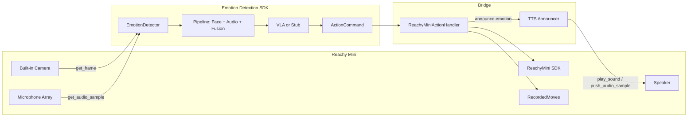

# Reachy Mini Emotion-Responsive App

## Architecture




## Key Interfaces

**Emotion SDK output** (`[ActionCommand](../emotion-detection-action/src/emotion_detection_action/core/types.py)`):

- `action_type`: idle, acknowledge, comfort, de_escalate, reassure, wait, retreat, approach, gesture, speak
- `parameters`: `{gesture, intensity, emotion, duration, ...}`

**Reachy Mini SDK** ([docs](https://huggingface.co/docs/reachy_mini/SDK/readme)):

- `ReachyMini(media_backend="default")` - enables built-in camera and microphone array
- `mini.media.get_frame()` - returns BGR numpy array (H, W, 3), OpenCV-compatible ([Take Picture example](https://huggingface.co/docs/reachy_mini/v1.3.1/en/examples/take_picture))
- `mini.media.start_recording()` / `stop_recording()` - must call before/after audio capture
- `mini.media.get_audio_sample()` - returns `(samples, 2)` float32 at 16 kHz (stereo from 4-mic array)
- `mini.media.get_input_audio_samplerate()` - verify sample rate (typically 16000)
- `goto_target(head, antennas, body_yaw, duration)` - smooth pose interpolation
- `create_head_pose()` - head pose builder
- `play_move(move, initial_goto_duration)` - pre-recorded emotions from `pollen-robotics/reachy-mini-emotions-library`
- `look_at_image(u, v, duration)` - gaze at face (optional for "looking at humans")
- **Speaker output**: `mini.media.play_sound(path)` for WAV files; or `start_playing()` + `push_audio_sample(data)` + `stop_playing()` for streaming (float32, 16 kHz, mono or stereo)

**Emotion SDK audio input** ([detector.py](../emotion-detection-action/src/emotion_detection_action/core/detector.py)):

- `process_frame(frame, audio=None, timestamp=0.0)` - `audio` is `np.ndarray`, wrapped in `AudioChunk` with `Config.sample_rate` (default 16000 Hz)
- Voice/speech models expect 16 kHz mono; SDK handles float32/int16

---

## Implementation Plan

### 1. Project Setup

Create minimal project structure in `reachy-emotion/`:

- `pyproject.toml` with dependencies:
  - `emotion-detection-action` (path or editable install from `../emotion-detection-action`)
  - `reachy-mini` (from PyPI)
  - `opencv-python` (for camera)
  - `gtts` (Google Text-to-Speech) or `pyttsx3` (offline TTS)
- `README.md` with setup and run instructions

### 2. ReachyMiniActionHandler

Create a new `BaseActionHandler` implementation that maps `ActionCommand` to Reachy Mini commands.

**Location**: `reachy_emotion/reachy_handler.py` (or `src/reachy_emotion/`)

**Design**:

- Extend `BaseActionHandler` from `emotion_detection_action.actions.base`
- Implement `connect()` / `disconnect()`: instantiate `ReachyMini(media_backend=...)` and hold reference
- Implement `execute(action: ActionCommand) -> bool`: dispatch by `action_type`
- **Shared instance**: The handler's `ReachyMini` instance is also used by the main loop for `mini.media.get_frame()` - single connection for both camera and robot control
- **Emotion announcement**: After executing the physical action, announce the detected emotion via TTS through Reachy's speaker (see section 2b)

**Action-to-Reachy mapping**:


| action_type | Reachy Mini command                                                                 |
| ----------- | ----------------------------------------------------------------------------------- |
| idle        | `goto_target(antennas=[0, 0])` or neutral pose                                      |
| acknowledge | `play_move(moves.get("happy"))` or head nod via `create_head_pose(pitch=10)`        |
| comfort     | `play_move(moves.get("sad"))` or antennas forward, gentle head tilt                 |
| de_escalate | `goto_target(body_yaw=-0.2)` (step back), antennas down                             |
| reassure    | `play_move(moves.get("fearful"))` or slow antenna wave                              |
| wait        | Hold current pose (no-op or minimal)                                                |
| retreat     | `goto_target(body_yaw=-0.3)`                                                        |
| approach    | `goto_target(body_yaw=0.2)`                                                         |
| gesture     | Use `parameters["gesture"]` or `parameters["emotion"]` to pick `RecordedMoves` move |
| speak       | Announce emotion via TTS (see Emotion Announcement below)                           |


**Emotion announcement** (in addition to physical actions):

- On each `execute(action)`, after performing the physical action, announce the detected emotion via Reachy's speaker
- Use `action.parameters.get("emotion")` or pass `EmotionResult` from main loop (handler may need `execute_with_context(action, emotion_result)` or main loop calls `handler.announce(emotion)` separately)
- **TTS flow**: Generate speech from text (e.g. "I detect you seem happy") → convert to float32 16 kHz mono → `mini.media.start_playing()` → `push_audio_sample(chunk)` in loop → `stop_playing()`
- **TTS library**: `gTTS` (Google, requires internet) or `pyttsx3` (offline, cross-platform) or `edge-tts` (Microsoft, requires internet). Prefer lightweight: `gTTS` + `pydub` to convert MP3 to WAV, or `pyttsx3` for offline
- **Announcement template**: "I detect you seem {emotion}" or "You appear {emotion}" (happy, sad, angry, etc.)
- **Throttling**: Only announce when emotion changes or after minimum interval (e.g. 5 seconds) to avoid repetitive speech. Track `last_announced_emotion` and `last_announce_time`

**Emotion fallback**: When `action_type` is generic (e.g. `gesture`, `stub`), use `parameters.get("emotion")` to select from emotions library: `happy`, `sad`, `angry`, `fearful`, `surprised`, `disgusted`, `neutral`. Use `RecordedMoves.list_moves()` to discover available move names and map emotion labels to closest match.

**Threading**: Reachy Mini SDK calls are blocking. Run `execute()` in a thread or use non-blocking `set_target` for high-frequency updates. For `play_move`, blocking is acceptable. Run announcement in a background thread to avoid blocking the main loop.

### 2b. Emotion Announcement (TTS)

**Location**: `reachy_emotion/tts_announcer.py`

- **Role**: Convert detected emotion to speech and play through Reachy's speaker
- **API**: `announce(emotion: str, mini: ReachyMini) -> None` – generates "I detect you seem {emotion}", converts to audio, plays via `mini.media`
- **TTS**: Use gTTS to generate MP3, convert to WAV/float32 16 kHz, stream via `push_audio_sample()` or use `play_sound()` if Reachy accepts WAV path
- **Throttling**: Caller (handler or main loop) enforces minimum interval and emotion-change check before calling `announce()`

### 3. Main App Entry Point

**File**: `reachy_emotion/main.py` or `run.py`

**Media source: Reachy Mini's built-in camera and microphone**. Single `ReachyMini` connection provides robot control, camera, and audio via `media_backend`.

- Parse CLI: `--sim` (Reachy daemon sim mode), `--device` (cpu/cuda), `--media-backend` (default/gstreamer/webrtc), `--use-webcam` (fallback for testing without robot), `--no-audio` (disable audio input), `--no-announce` (disable emotion announcement via speaker)
- Connect: `ReachyMini(media_backend=args.media_backend)` - enables `mini.media.get_frame()` and `mini.media.get_audio_sample()`
- **Audio setup**: Call `mini.media.start_recording()` after connect; call `mini.media.stop_recording()` on shutdown
- Frame loop (not `detector.stream()`): poll `frame = mini.media.get_frame()` and `audio = mini.media.get_audio_sample()`; on valid frame, call `detector.process_frame(frame, audio=audio_mono, timestamp=time.time())`
- On each `PipelineResult`: handler receives `result.action` via the detector's built-in callback; pass `result.emotion.dominant_emotion.value` to handler for announcement (extend handler or call `handler.announce(emotion)` from main loop after `execute`)
- Handle `get_frame()` or `get_audio_sample()` returning `None` (retry/skip; audio can be `None` for vision-only)

**Audio format conversion** (Reachy → Emotion SDK):

- Reachy returns `(samples, 2)` float32 stereo at 16 kHz
- Emotion SDK expects 16 kHz mono; `Config.sample_rate=16000` matches
- Convert: `audio_mono = audio.mean(axis=1)` or `audio[:, 0]` to get mono
- If Reachy sample rate differs from 16 kHz, resample (e.g. `scipy.signal.resample` or `torchaudio`) before passing to `process_frame`

**Fallback**: `--use-webcam N` uses `cv2.VideoCapture(N)` for video; audio is `None` unless a separate system mic is used. `--no-audio` skips Reachy mic for vision-only mode.

### 4. Optional: Face Gaze (Looking at Humans)

To have the robot "look at" the detected person:

- `DetectionResult` from the emotion SDK contains face bounding box
- Use `look_at_image(u, v, duration)` with the face center (u, v) from the camera image
- This requires passing image dimensions and face bbox to the handler, or extending the handler to accept `DetectionResult` alongside `ActionCommand`. The current `execute(action)` only receives `ActionCommand`. Options:
  - **A**: Add optional `execute_with_context(action, detection)` to a custom handler
  - **B**: Run gaze in the main loop separately: after each result, call `mini.look_at_image(...)` before/after handler.execute
  - **C**: Keep handler simple; add gaze logic in main loop that uses `result.detection` and a shared `ReachyMini` instance

Recommend **C** for simplicity: main loop holds both detector and mini; on each result, (1) optionally call `mini.look_at_image(face_center)`, (2) call `handler.execute(result.action)`.

### 5. Simulation and Offline Testing

- **Reachy daemon**: `uv run reachy-mini-daemon --sim` for simulation (camera and microphone may be simulated or unavailable in sim)
- **Emotion SDK**: Use `vla_enabled=False` for stub mode (emotion-only, no VLA model)
- **No-robot mode**: Add `--no-robot --use-webcam 0` to run emotion detection with webcam and `LoggingActionHandler` (for development without Reachy hardware)
- **Audio in sim**: If `get_audio_sample()` returns `None` in simulation, pass `audio=None` to `process_frame` (vision-only fusion)

---

## File Structure

```
reachy-emotion/
├── pyproject.toml
├── README.md
├── initial-plan.md
├── src/
│   └── reachy_emotion/
│       ├── __init__.py
│       ├── reachy_handler.py   # ReachyMiniActionHandler + emotion announcement
│       ├── tts_announcer.py    # TTS generation and Reachy speaker playback
│       └── main.py             # Entry point, stream loop
└── run.sh (optional)            # uv run reachy-mini-daemon --sim & python -m reachy_emotion.main
```

---

## Dependencies Summary


| Package                  | Purpose                                                                  |
| ------------------------ | ------------------------------------------------------------------------ |
| emotion-detection-action | Emotion + VLA pipeline, ActionCommand, BaseActionHandler                 |
| reachy-mini              | ReachyMini, media.get_frame(), play_sound, push_audio_sample, RecordedMoves |
| opencv-python            | Frame handling (emotion SDK uses it; Reachy frames are BGR numpy arrays) |
| gTTS / pyttsx3           | Text-to-speech for emotion announcement (gTTS: online, pyttsx3: offline) |


---

## Open Questions

1. **Emotions library move names**: The `pollen-robotics/reachy-mini-emotions-library` has moves via `list_moves()`. Confirm at runtime which emotion labels (happy, sad, etc.) exist. Fallback to `goto_target(antennas=[...])` for missing moves.
2. **Action throttling**: To avoid overwhelming the robot, consider debouncing: only execute a new action if the previous one finished or after a minimum interval (e.g. 2–3 seconds).
3. **VLA vs stub**: Start with `vla_enabled=False` (stub) for faster iteration; enable VLA when ready for richer action suggestions.
4. **TTS choice**: gTTS (simple, online) vs pyttsx3 (offline, system voices) vs edge-tts (high quality, online). Default to gTTS for simplicity; add pyttsx3 as fallback for offline use.
