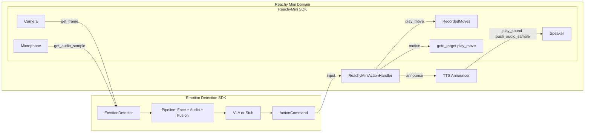
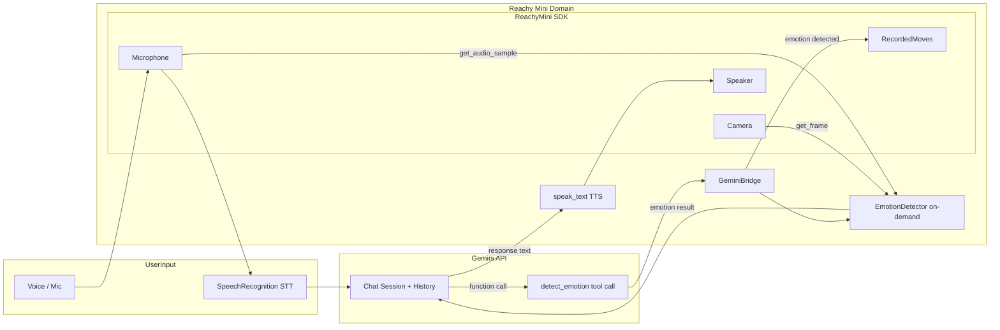

# Reachy Mini Emotion-Responsive App

## Architecture

### Mode 1 — Continuous Emotion Detection Loop


```mermaid
flowchart LR
    subgraph EmotionSDK [Emotion Detection SDK]
        Detector[EmotionDetector]
        Pipeline[Pipeline: Face + Audio + Fusion]
        VLA[VLA or Stub]
        ActionCmd[ActionCommand]
    end
    
    subgraph ReachyMiniDomain [Reachy Mini Domain]
        Handler[ReachyMiniActionHandler]
        TTS[TTS Announcer]
        subgraph ReachySDK [ReachyMini SDK]
            Camera[Camera]
            Mic[Microphone]
            Speaker[Speaker]
            RecordedMoves[RecordedMoves]
            Motion[goto_target play_move]
        end
    end
    
    Camera -->|get_frame| Detector
    Mic -->|get_audio_sample| Detector
    Detector --> Pipeline --> VLA --> ActionCmd
    ActionCmd -->|input| Handler
    Handler -->|motion| Motion
    Handler -->|play_move| RecordedMoves
    Handler -->|announce| TTS
    TTS -->|play_sound push_audio_sample| Speaker
```

**Domain boundary**: The Reachy Mini domain receives `ActionCommand` as its sole input. The ReachyMini SDK (camera, mic, speaker, RecordedMoves, motion) is the platform the handler and TTS use.

---

### Mode 2 — Gemini Conversation with Emotion as a Tool Call


```mermaid
flowchart LR
    subgraph UserInput
        Voice[Voice / Mic]
        STT[SpeechRecognition STT]
    end

    subgraph GeminiCloud [Gemini API]
        Chat[Chat Session + History]
        Tool[detect_emotion tool call]
    end

    subgraph ReachyMiniDomain [Reachy Mini Domain]
        Bridge[GeminiBridge]
        TTS[speak_text TTS]
        EmotionDet[EmotionDetector on-demand]
        subgraph ReachySDK [ReachyMini SDK]
            Camera[Camera]
            Mic[Microphone]
            Speaker[Speaker]
            RecordedMoves[RecordedMoves]
        end
    end

    Voice --> Mic --> STT --> Chat
    Chat -->|function call| Tool --> Bridge
    Bridge --> EmotionDet
    Camera -->|get_frame| EmotionDet
    Mic -->|get_audio_sample| EmotionDet
    EmotionDet -->|emotion result| Chat
    Chat -->|response text| TTS
    TTS --> Speaker
    Bridge -->|emotion detected| RecordedMoves
```

**Conversation history**: Maintained automatically by `client.chats.create()` in the `google-genai` SDK. Every `chat.send_message()` call includes the full prior history plus the system prompt.

**Tool call flow**: Gemini may call `detect_emotion` before formulating its reply. The bridge executes the local emotion SDK (camera + audio sample), returns the result dict to Gemini, and Gemini then generates its text response informed by the emotion data.


## Key Interfaces

**Reachy Mini domain input** – `ActionCommand` from the emotion SDK (`[ActionCommand](../emotion-detection-action/src/emotion_detection_action/core/types.py)`):

- `action_type`: idle, acknowledge, comfort, de_escalate, reassure, wait, retreat, approach, gesture, speak, stub
- `parameters`: `{gesture, intensity, emotion, duration, ...}`

**Reachy Mini SDK** ([docs](https://huggingface.co/docs/reachy_mini/SDK/readme)) – platform providing:

| SDK component | API | Used by |
|---------------|-----|---------|
| Camera | `get_frame()` → BGR numpy array | Emotion Detector (main loop / Gemini tool call) |
| Microphone | `get_audio_sample()` → (samples, 2) float32 @ 16 kHz | Emotion Detector / Voice Input |
| Speaker | `play_sound(path)` | TTS Announcer (`speak_text`) |
| RecordedMoves | `RecordedMoves("pollen-robotics/reachy-mini-emotions-library")` | Handler, conversation reaction |
| Motion | `goto_target()`, `play_move(move)` | Handler |
| Gaze | `look_at_image(u, v, duration)` | Main loop face tracking |

- `ReachyMini(media_backend="default")` enables Camera and Microphone; `start_recording()` / `stop_recording()` required for Mic

**Emotion SDK** ([detector.py](../emotion-detection-action/src/emotion_detection_action/core/detector.py)):

- Receives frame (from Reachy Camera) and audio (from Reachy Mic) via `process_frame(frame, audio=None, timestamp=0.0)`
- Outputs `ActionCommand` to Reachy Mini domain (Mode 1) or `EmotionResult` dict to Gemini (Mode 2)

**GeminiBridge** (`gemini_bridge.py`):

- Wraps `client.chats.create()` — persistent multi-turn session with full history
- Registers `detect_emotion` as a `FunctionDeclaration` tool
- `chat(user_text) -> (response_text, EmotionResult | None)`
- Runs emotion detection on-demand when Gemini calls the tool

---

## Implementation Plan

**Domain separation**: The emotion SDK produces `ActionCommand`; the Reachy Mini domain consumes it. The Reachy Mini domain uses the ReachyMini SDK (Camera, Mic, Speaker, RecordedMoves, Motion). The handler invokes Motion and RecordedMoves; TTS invokes Speaker. The domain boundary is the `ActionCommand` interface.

### 1. Project Setup ✅

Create minimal project structure in `reachy-emotion/`:

- `pyproject.toml` with dependencies (see Dependencies Summary)
- `README.md` with setup and run instructions
- `.env.example` for Gemini API key
- `.gitignore` for secrets and build artifacts

### 2. ReachyMiniActionHandler (Reachy Mini Domain) ✅

The handler lives in the **Reachy Mini domain**. It receives `ActionCommand` as input and invokes the **ReachyMini SDK** for motion and announcement.

**Dual-mode support**:
- `ReachyMiniActionHandler()` — standalone: creates and owns its `ReachyMini` connection
- `ReachyMiniActionHandler(mini=existing_mini)` — app framework mode: reuses a pre-connected instance (does not call `__enter__`/`__exit__`)

**Action-to-SDK mapping**:

| action_type | SDK invocation |
| ----------- | -------------- |
| idle        | `goto_target(antennas=[0, 0])` |
| acknowledge | RecordedMoves: `play_move(happy)` or antenna nod |
| comfort     | RecordedMoves: `play_move(sad)` |
| de_escalate | `goto_target(body_yaw=-0.2)` |
| reassure    | RecordedMoves: `play_move(fearful)` |
| wait        | No-op |
| retreat     | `goto_target(body_yaw=-0.3)` |
| approach    | `goto_target(body_yaw=0.2)` |
| gesture / stub | RecordedMoves: pick from `parameters["emotion"]` |
| speak       | TTS only (no motion) |

### 2b. TTS Announcer ✅

**File**: `reachy_emotion/tts_announcer.py`

- `speak_text(text, mini, lang)` — core function: gTTS → MP3 → pydub → 16 kHz mono WAV → `mini.media.play_sound()`
- `announce_emotion(emotion, mini)` — delegates to `speak_text("I detect you seem {emotion}", ...)`
- `ffmpeg` system dependency: detected via `shutil.which`; missing ffmpeg logs a one-time error and disables TTS silently

### 3. Main App Entry Point ✅

**File**: `reachy_emotion/main.py`

- `ReachyEmotionApp(ReachyMiniApp)` — dashboard app class; `run(reachy_mini, stop_event)` calls `_run_emotion_loop()`
- `_run_emotion_loop(mini, stop_event, ...)` — shared logic for both app class and CLI
- CLI: `reachy-emotion` script; flags: `--sim`, `--device`, `--media-backend`, `--use-webcam`, `--no-audio`, `--no-announce`, `--no-gaze`, `--no-robot`
- Face gaze: `gaze_at_face(mini, detection)` calls `mini.look_at_image(u, v)` toward face bbox center

### 4. Gemini Conversation ✅

#### 4a. GeminiBridge (`gemini_bridge.py`)

- `GeminiBridge(api_key, mini, system_prompt, model)`
- `initialize()`: creates `client.chats.create()` with system prompt + `detect_emotion` tool; initialises `EmotionDetector` with `LoggingActionHandler` (no physical actions on tool calls)
- `chat(user_text) -> (response_text, EmotionResult|None)`: sends message, handles tool call loop, returns final text
- `shutdown()`: releases emotion detector

#### 4b. Voice Input (`voice_input.py`)

- `listen(mini, sample_rate, language) -> str | None`
- Energy-based VAD: records until silence detected after speech; max 12 s
- Converts numpy audio → WAV bytes → `speech_recognition.AudioData` → Google STT

#### 4c. Conversation App (`conversation_app.py`)

- `run_conversation_loop(mini, stop_event, system_prompt, voice_mode, language, model)`
- Per-turn: `listen()` → `bridge.chat()` → `_react_to_emotion()` (RecordedMoves) → `speak_text()` (TTS)
- `ReachyConversationApp(ReachyMiniApp)` — dashboard app; `_cli_main()` — `reachy-emotion-chat` script

### 5. Simulation and Offline Testing ✅

- **Reachy daemon**: `uv run reachy-mini-daemon --sim`
- **Emotion SDK**: `vla_enabled=False` for stub mode
- **No-robot mode**: `--no-robot` — uses `LoggingActionHandler` and webcam
- **Text conversation**: `reachy-emotion-chat --text` — skips STT, reads from stdin

---

## File Structure

```
reachy-emotion/
├── .env.example                      # API key template (copy to .env)
├── .gitignore
├── index.html                        # HF Space landing page
├── style.css
├── pyproject.toml                    # Package config + all dependencies
├── README.md
├── initial-plan.md                   # This file
└── src/
    └── reachy_emotion/
        ├── __init__.py
        ├── main.py                   # ReachyEmotionApp (emotion loop) + CLI
        ├── reachy_handler.py         # ActionCommand → Motion, RecordedMoves, TTS
        ├── tts_announcer.py          # speak_text() + announce_emotion() via gTTS/pydub
        ├── gemini_bridge.py          # Gemini chat session + detect_emotion tool
        ├── voice_input.py            # STT from Reachy mic via SpeechRecognition
        └── conversation_app.py       # ReachyConversationApp (Gemini chat) + CLI
tests/
    ├── __init__.py
    ├── test_tts_announcer.py
    ├── test_voice_input.py
    ├── test_gemini_bridge.py
    └── test_reachy_handler.py
```

---

## Dependencies Summary

| Package | Purpose |
| ------- | ------- |
| `emotion-detection-action` | Emotion + VLA pipeline, ActionCommand, BaseActionHandler |
| `reachy-mini` | ReachyMini SDK: Camera, Mic, Speaker, RecordedMoves, Motion |
| `opencv-python` | Frame handling (BGR numpy from SDK Camera) |
| `numpy` | Audio mono conversion, array math |
| `gtts` | Google Text-to-Speech (generates MP3) |
| `pydub` | MP3 → 16 kHz mono WAV conversion for Speaker API |
| `google-genai` | Gemini API client (chat sessions, function calling) |
| `python-dotenv` | Load GEMINI_API_KEY from `.env` |
| `SpeechRecognition` | Google STT: numpy audio → transcribed text |
| **System: ffmpeg** | Required by pydub for MP3 decoding |

---

## Open Questions / Future Work

1. **Emotions library move names**: Confirm at runtime which emotion labels exist via `list_moves()`. Fallback to `goto_target(antennas=[...])` for missing moves.
2. **Action throttling**: Debounce rapid identical actions (currently 2 s interval + 5 s TTS interval).
3. **VLA vs stub**: Currently `vla_enabled=False`; enable for richer action suggestions.
4. **VAD improvement**: Replace energy-based VAD in `voice_input.py` with `webrtcvad` for more accurate speech endpoint detection.
5. **Context window management**: Gemini conversation history grows without bound; add optional turn-count limit for very long sessions.
6. **Offline TTS**: Add `pyttsx3` or `edge-tts` as a fallback for environments without internet.
